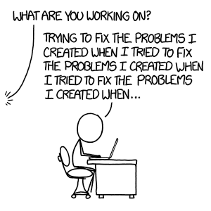

Much like looking up a word that means "for it's own sake," or more properly, "an end in and of itself," my approach to computer science is autotelic.  I choose to learn computer science because it interests me.  I'm not saying it lies in a vacuum, devoid of external motivations, but rather that the greatest factor in why I study CS is, "Because I want to."  When you ask me, "What do you want to get out of this course?", the answer is usually, "Whatever I can."  On one hand, it hints at a lack of direction, on the other hand, isn't that the best reason to want to learn?

So I guess the big question that leaves is, "Why?  What is so motivating about computer science?"  I love computer science in the same way I love math and CTFs and other forms of puzzle, the joy of struggling against a difficult problem for hours on end, the beauty of an elegant proof, the ever-motivating frustration of running into a wall, all of it is just... wonderful.

I want to learn whatever I can about CS for the sake of knowing, to be better able to understand how things work.  I intend to make a career of it all one day, but for now I am content to enjoy it for what it is: the knowledge to solve more problems and to better understand processes otherwise left arcane.  There's a limited amount of time in one's life where one possesses the freedom to explore and learn what they please; my approach to life thus far may seem aimless, and indeed, it is, but for now, just for now, that is enough.
