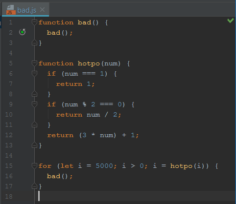

Coding standards, bane of messy programers, slayer of mismatched indentation.

Coding standards allow for many people to collaborate on a single project while keeping the general style of code identical, allowing for easier reading and integration.

Ultimately, coding standards can do wonders for improving readability but they can do little to help comprehensibility.  Code can easily remain remarkably opaque.  One person might write function after function, making reading their code a nightmare of hide-and-seek.  Another might simply be inefficient, using lines and lines of code to accomplish even simple tasks.  Another might use functional programing to write nested functions which must be unpacked.

Beyond that, coding standards can't do a thing for code that's just plain stupid.