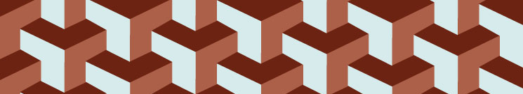

Patterns.  It's at the core of the programmer's mindset, if you see a pattern, reduce it.  When you have to do the same task, again and again, automate it.  When a problem arises repeatedly, write once an reuse.

Given how integral patterns are to programming, does it not make sense that meta-patterns should emerge?  Patterns upon patterns, rather than a single task repeating, a style of task seen time after time, solved in similar ways.

Design patterns step in to fill this gap.  General solutions to classes of problems.  Some are meant to take you up a level of abstraction, changing how the user or the programmer, interacts with the code.  Others are just there to conveniently bundle data together, or shuttle it around.  It's hard to generalize the function of design patterns as they aren't just one thing, they are the set of solutions people have come up with for a variety of problems.  As new problems emerge, surely so to shall new design patterns.  Frequently though, they are methods by which information is communicated, coordinated, controlled, and concealed.

In languages with inheritance, you may create a superclass of a series of related classes and use this superclass to implement basic, shared functions.  In app development, you will probably control what the user sees, allowing them to interact with the backend only through carefully controlled functions.  Interactive functions require the ability to coordinate disparate elements.

To use design patterns is to see how new problems are similar to old ones, to see patterns in problems, and in their solutions, to understand how the old can become the new, or how the new is built on the old.  Design patterns aren't so much a thing to be known, as a way of thought to be understood and used.  To be able to see patterns, and to be able to use them.
