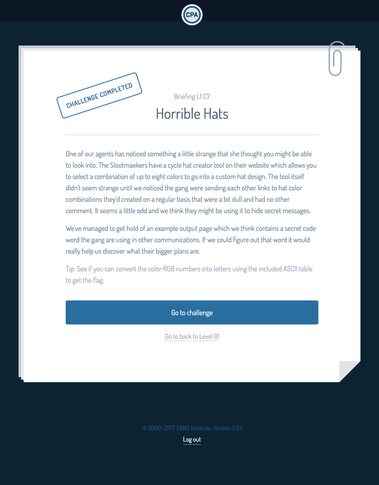

The SANS CyberStart challenge was a CTF competition aimed at highschool and college students and run by the SANS Institute with scholarships and further training offered as prizes to top contestants.

CyberStart was an individual competition.

The CyberStart challenge, while not granting a deep understanding in any one subject, introduced a number of topics, from the command line, to hashes, python, steganography, cross-site scripting, injection attacks, and more.

Read More: <a href="https://www.sans.org/CyberStartUS"><i class="large Id Card icon"></i>SANS CyberStart</a>
