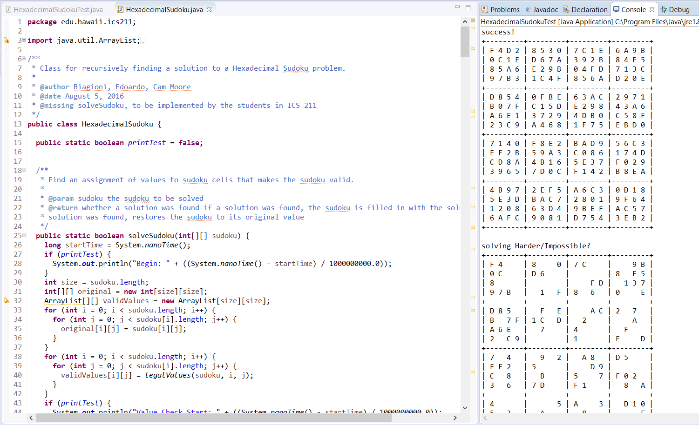

Recursive Sudoku was a project from ICS 211 with the goal of creating a recursive program to solve a hexadecimal sudoku puzzle.  The main idea being to create a brute-force program that would quickly run through possible solutions until finding a valid one.  The puzzles provided frequently had several possible solutions that a program might happen upon.

Recursive Sudoku was a solo project, however, much of the test code was provided, as attributed in the top most comments of the java files, by Biagioni, Edoardo, and Cam Moore.  I wrote the functions to determine possible solutions by more conventional sudoku rules (if a square can only be one value, it is that value, if a square is the only square in its row, column, or box, to have a certain value, it is that value, if two squares in the same row, column or box have only two possible values, and the same two values, no other square in the row, column, or box, as appropriate, can have either of those values).  There is a function to generate the lists of possible values and a function to test all possible combinations.

In the end, Recursive Sudoku wound up being a lesson in the danger of overengineering.  Coding it to use more conventional sudoku rules for as long as possible took significant amounts of time to write while creating a rather insignificant difference in performance.  Indeed, the program's reliance on this new structure, which attempted to keep track of remaining available options slowed the program down greatly due to the recursive nature of the project.  While the checks were mostly harmless when applied once, attempting to apply them at every level of recursion bogged it down.  In the end, my solution would take an hour to solve the test problems provided while simple, purely brute-force solutions managed the same in mere minutes.  Huge masses of for-loops, 2D arrays of ArrayLists, hundreds of lines of extra code, tens of hours of time lost, all to create a program less efficient and harder to understand than before.  It is a project I am both proud of, and ashamed of.  In both aspects, for the complexity of the program written (for all that it may pale in comparison to more competent and complex programs).  In time, hopefully it shall become a reminder of an early failure.  That frequently, the simple solutions are best.  And to know when to be clever and when to be wise.

Source: <a href="https://github.com/lyuyeda/HexSudoku"><i class="large github icon"></i>HexSudoku</a>
