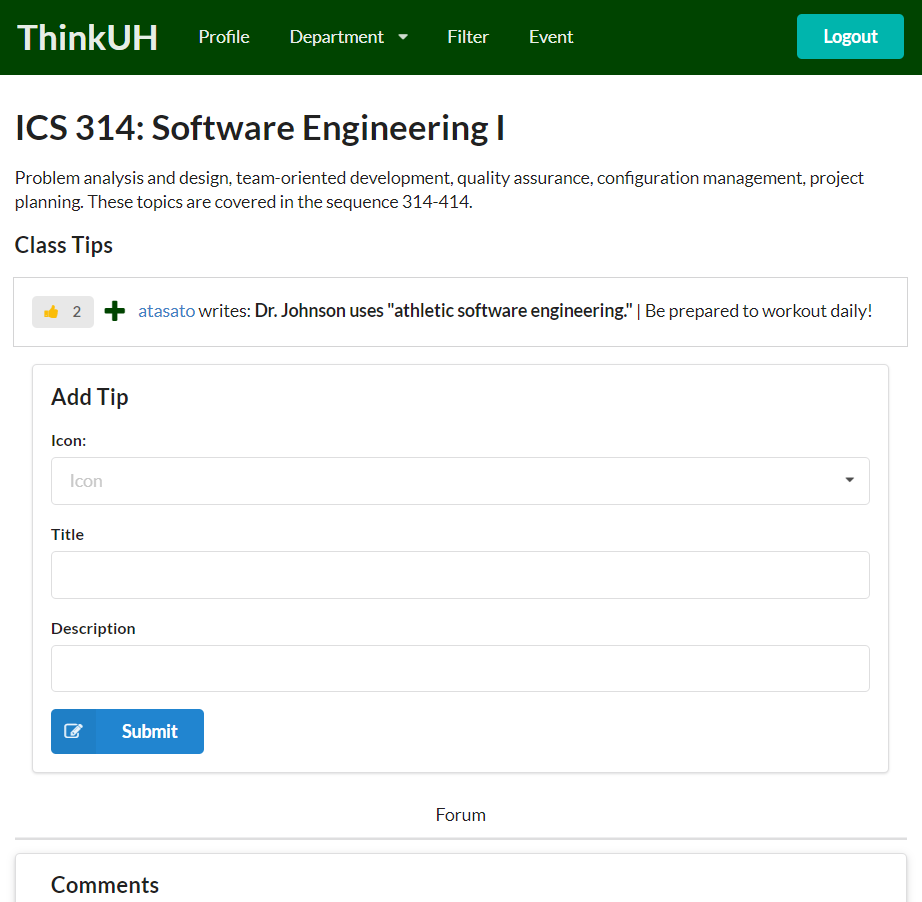

ThinkUH was part of an app development project for a software design course I took in 2017.  There's actually [a deployment](https://thinkuh.meteorapp.com/) of it running, as of the writing of this, though it may have since been taken down.  It aimed at being a site students could go to to find out more about the UH community, what events were going, what clubs there were, what classes were like.  We wanted to make something that students, new students in particular, could go through and plan out their course through UH, finding your prereqs, preparing for classes, choosing out clubs, and connecting with other students.

Though it was never finished, the project was meant as more of an experience in learning app development through Meteor.  It was my introduction to coding on a more 'real-world' scale.  While still of modest size, working on ThinkUH gave insight into how larger websites and databases are put together.  It was also one of the first large scale projects I worked on, where all the team members took it seriously.  It was an insight into the development process.

My part in the process was the creation of the pages and associated databases for the majors and classes.  Learning how to link pages together and pass information from one page to another.  The HTML for each of those pages is quite brief, the contents are provided via Handlebars.  Sometimes it would be passed in to a template, other times it was taken from the URL.  In any case, the writing itself was taken from a database.  There is no page for ICS 314 in the app, rather, there is a page for courses and an entry in the CourseCollection which work together to create the page for ICS 314 that you can see on the site.

Organization: <a href="https://github.com/thinkuh"><i class="github icon"></i>ThinkUH</a>
