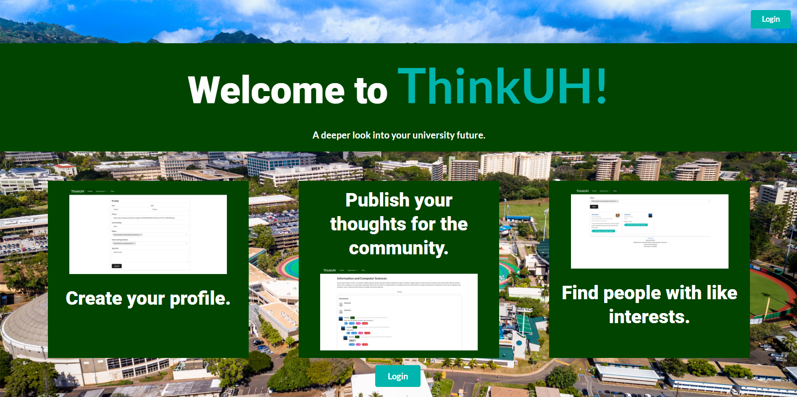

ThinkUH was part of an app development project for a software design course I took in 2017.  There's actually [a deployment](https://thinkuh.meteorapp.com/) of it running, as of the writing of this, though it may have since been taken down.

Though it was never finished, the porject was meant as more of an experience in learning app development through Meteor.  It was my introduction to coding on a more 'real-world' scale.  While still of modest size, working on ThinkUH gave insight into how larger websites and databases are put together.

Source: <a href="https://thinkuh.github.io/"><i class="github icon"></i>ThinkUH</a>
